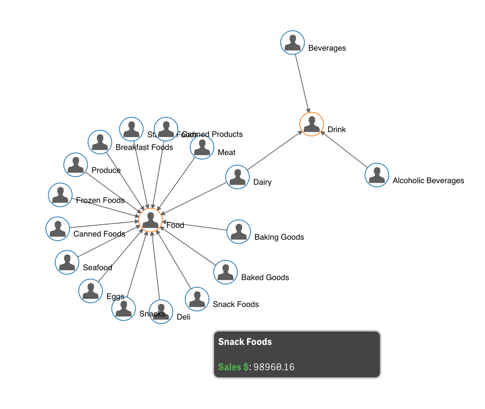

# qsense-orgchart-extension

## How it looks

## How it works
- Use two dimensions to create an orgchart (nodes) showing the parent-child relation them.
- First dimension is the actual child. Second should be the intended related parent.

- Use measures to complete the data displyed in the Tooltip when you hoverover one node.

